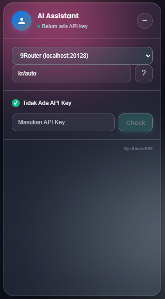
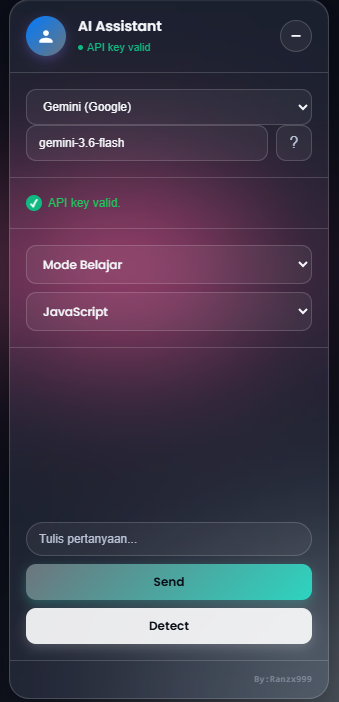

# AI Assistant Widget

AI Assistant Widget adalah ekstensi Chrome/Edge berbasis **Manifest V3** dengan UI floating glassmorphism untuk membantu belajar, membaca soal dari halaman web, dan chat dengan AI via **Gemini** atau **9Router**.

> Dibuat oleh **Ranzx999**

---

## Preview


| Widget Chat | Minimize Mode | Model Picker |
|---|---|---|
|  |  |  |

---

## Fitur

- Floating AI chat widget langsung di halaman web.
- Desain **glassmorphism** dengan background blob blur warna ungu, tosca, dan pink.
- Drag & drop widget dari header.
- Minimize menjadi logo transparan blur.
- Validasi API key sebelum chat aktif.
- Support provider:
  - Google Gemini API
  - 9Router lokal: `http://localhost:20128/v1`
- Tombol list model untuk 9Router.
- Model list rapi, grouped per provider.
- Mode jawaban:
  - **Mode Belajar**
  - **Mode Coding**
- Pilihan bahasa coding:
  - JavaScript
  - Python
  - HTML
  - CSS
  - PHP
  - C#
  - Java
  - C++
- Detect teks soal dari halaman web.
- Session chat selama tab tidak di-refresh.
- Code block rapi dengan tombol **Copy** dan **Auto-Type**.
- Responsive untuk layar kecil.
- Watermark: `By:Ranzx999`.

---

## Struktur Folder

```txt
ai-widget/
├── manifest.json
├── content.js
├── background.js
├── style.css
├── README.md
└── docs/
    └── screenshots/
        ├── .gitkeep
        ├── widget.png
        ├── minimize.png
        └── models.png
```

---

## Instalasi di Chrome / Edge

1. Clone atau download repository ini.
2. Buka browser:
   - Chrome: `chrome://extensions/`
   - Edge: `edge://extensions/`
3. Aktifkan **Developer mode**.
4. Klik **Load unpacked**.
5. Pilih folder ekstensi:

```txt
D:\XIIRPLC\Project\ai-widget
```

6. Buka halaman web biasa, contoh:

```txt
https://example.com
```

Widget akan muncul di kanan bawah.

> Content script tidak berjalan di halaman `chrome://`, `edge://`, Chrome Web Store, atau PDF viewer bawaan browser.

---

## Setup API Key

### Gemini

1. Pilih provider **Gemini (Google)**.
2. Isi model Gemini, contoh:

```txt
gemini-3.6-flash
```

3. Masukkan API key Gemini.
4. Klik **Check**.

### 9Router

1. Jalankan 9Router lokal.
2. Buka dashboard:

```txt
http://localhost:20128/dashboard
```

3. Ambil API key dari menu **Keys**.
4. Di widget pilih provider:

```txt
9Router (localhost:20128)
```

5. Isi model, contoh:

```txt
kr/auto
```

atau klik tombol `?` untuk melihat daftar model.

6. Klik **Check**.

---

## Cara Pakai

1. Masukkan API key.
2. Klik **Check**.
3. Pilih mode:
   - **Mode Belajar** untuk jawaban singkat + penjelasan pendek.
   - **Mode Coding** untuk jawaban berupa kode rapi.
4. Klik **Detect** untuk membaca teks soal dari halaman.
5. Edit teks jika perlu.
6. Klik **Send**.

---

## Catatan Keamanan

API key yang dipakai di ekstensi client-side bisa dilihat dari browser. Jangan commit API key ke GitHub.

Untuk penggunaan publik/produksi, lebih aman memakai backend proxy agar API key tidak tersimpan di sisi client.

---

## Development Check

Cek syntax JavaScript:

```bash
node --check content.js
node --check background.js
```

Reload ekstensi setelah mengubah file:

1. Buka `chrome://extensions/`.
2. Klik **Reload** pada ekstensi.
3. Refresh halaman web.

Jika menambah file baru seperti `background.js`, lebih aman:

1. Remove ekstensi.
2. Load unpacked ulang.

---
---

## Credit

Created by **Ranzx999**.
